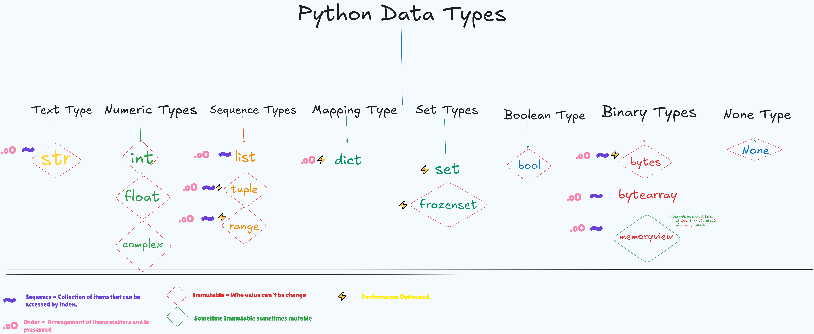

###### Ue Ctrl+Shift+V to open the markdown preview.

# Python vs TypeScript/JavaScript: A Beginner-Friendly Comparison

## 1. Introduction

- Python and TypeScript/JavaScript are both widely used programming languages.
- Python is known for simplicity and readability.
- TypeScript is a superset of JavaScript with static typing.
- Both have different strengths and use cases.
- Python is a high-level, interpreted language.
- Python and JS/TS are object-centric, which means almost everything is an object, including functions.
- Both fully support OOP
- Both support first-class functions:

  - Can be assigned to variables

  - Can be passed as arguments

  - Can be returned from other functions
---

## 2. Basic Data Types

| Python 🐍                    | TypeScript/JavaScript 🟦      |
| ---------------------------- | ----------------------------- |
| `x = 10` (int)               | `let x: number = 10;`         |
| `y = 3.14` (float)           | `let y: number = 3.14;`       |
| `name = "Ali"` (str)         | `let name: string = "Ali";`   |
| `is_true = True` (bool)      | `let isTrue: boolean = true;` |
| `x = None` (null equivalent) | `let x: null = null;`         |

---


## 3. Lists vs Arrays

- Python uses **lists**, while TypeScript/JavaScript uses **arrays**.

```python
nums = [1, 2, 3]  # List
```

```typescript
let nums: number[] = [1, 2, 3]; // Array
```

---

## 4. Tuples vs Arrays (Readonly)

- Python has **tuples** (immutable), while TypeScript has **readonly arrays or tuples**.

```python
data = (4, 5, 6)  # Tuple
```

```ts
const data: readonly [number, number, number] = [4, 5, 6];
```

---

## 5. Dictionaries vs Objects/Maps

- Python uses **dict**, while TypeScript/JavaScript uses **objects or Map**.

```python
info = {"name": "Ali", "age": 25}  # Dictionary
```

```ts
const info: { name: string; age: number } = { name: "Ali", age: 25 };
```

---

## 6. Sets (Same in Both , just difference of syntax)

```python
unique = {1, 2, 3}  # Set
```

```ts
const unique = new Set([1, 2, 3]); // Set
```

---

## 7. Bytes & Bytearray vs Buffer

- Python has **bytes & bytearray**, while JavaScript has **Buffer**.

```python
b = b"hello"  # Bytes
ba = bytearray(b)  # Mutable Bytearray
```

```ts
const b = Buffer.from("hello"); // Buffer
```

---

## 8. Key Differences

- **Python lists ≈ JavaScript/TypeScript arrays**
- **Python tuples ≈ TypeScript readonly arrays**
- **Python dict ≈ JavaScript objects/Map**
- **Python has `None`, JavaScript has `null/undefined`**
- **Python uses indentation and colons ":" for blocks, TypeScript uses `{}`**
- Python is **dynamically typed**, while TypeScript is **statically typed**. 🚀

---

## 9. Function vs Definitions

### Python:

```python
def greet(name):
    return f"Hello, {name}!"
```

### JavaScript/TypeScript:

```ts
const greet = (name: string): string => `Hello, ${name}!`;
```

---

## 10. Conditions in Python vs JavaScript/TypeScript

### Python:

```python
if x > 10:
    print("Big")
elif x == 10:
    print("Equal")
else:
    print("Small")
```

### JavaScript/TypeScript:

```ts
if (x > 10) {
  console.log("Big");
} else if (x === 10) {
  console.log("Equal");
} else {
  console.log("Small");
}
```

---

## 11. Error Handling

### Python:

```python
raise ValueError("Error Message")
```

### JavaScript/TypeScript:

```ts
throw new Error("Error Message");
```

---

# Python Class 1 - Concepts Explained

## 1. Printing & Variable Assignment

```python
print("Hello World!!")

user_name = "abc"
print(user_name)

user_name = "xyz"
print(user_name)
```

### Comparison with JavaScript/TypeScript:

```ts
console.log("Hello World!!");

let userName = "abc";
console.log(userName);

userName = "xyz";
console.log(userName);
```

- Python uses ` print()` for output, whereas JavaScript/TypeScript uses `console.log()`.
- Variables in Python are dynamically typed, while TypeScript requires explicit types.

---

## 2. Naming Conventions

- Camel Case: `myVariableName` (JS/TS)
- Snake Case: `my_variable_name` (Python)
- Pascal Case: `MyVariableName` (Both)
- Lower Case: `myvariablename` (Both, but uncommon)
- Double Underscore: `__private_variable` (Python only, used for name mangling)

---

## 3. Data Types

```python
string = "Hello"
number = 42
float_num = 3.14
boolean = True
none_value = None
```

### Comparison with JavaScript/TypeScript:

```ts
let string: string = "Hello";
let number: number = 42;
let floatNum: number = 3.14;
let boolean: boolean = true;
let noneValue: null = null; // `None` in Python, `null` in JS/TS
```

- Python has `None`, whereas JavaScript/TypeScript has `null`.
- Python uses `True/False`, while JavaScript/TypeScript uses `true/false`.

---

## 4. String Interpolation

```python
first_name = "Fahad"
last_name = "Khan"
full_name = f"{first_name} {last_name}"
```

### Comparison with JavaScript/TypeScript:

```ts
let firstName = "Fahad";
let lastName = "Khan";
let fullName = `${firstName} ${lastName}`; // Template literals
```

- Python uses `f"{variable}"`, while JavaScript/TypeScript uses **template literals** `${variable}`.

---

## 5. String Methods

### Convert to Uppercase

```python
print(full_name.upper())
```

```ts
console.log(fullName.toUpperCase());
```

### Convert to Lowercase

```python
print(full_name.lower())
```

```ts
console.log(fullName.toLowerCase());
```

### Trim Whitespace

```python
print(full_name.strip())
```

```ts
console.log(fullName.trim());
```

### Replace Substrings

```python
text = "quick brown fox"
print(text.replace("fox", "dog"))
```

```ts
let text = "quick brown fox";
console.log(text.replace("fox", "dog"));
```

### Title Case (First Letter Capitalized)

```python
print("hello world".title())
```

```ts
// No built-in method, need custom function
console.log("hello world".replace(/\b\w/g, (c) => c.toUpperCase()));
```

### Swap Case (Upper to Lower & Vice Versa)

```python
print("Hello PYTHON".swapcase())
```

- **Not available in JavaScript/TypeScript**

### Check if String is Digit/Alpha/Alphanumeric

```python
print("12345".isdigit())  # True
print("Hello".isalpha())  # True
print("Hello123".isalnum())  # True
```

```ts
console.log(/^[0-9]+$/.test("12345")); // True
console.log(/^[a-zA-Z]+$/.test("Hello")); // True
console.log(/^[a-zA-Z0-9]+$/.test("Hello123")); // True
```

### Find Substring Index

```python
print("quick brown fox".find("fox"))  # Returns index
print("quick brown fox".find("dog"))  # Returns -1 (not found)
```

```ts
console.log("quick brown fox".indexOf("fox"));
// return index
console.log("quick brown fox".indexOf("dog"));
// return -1 if not found
```

### Count Occurrences

```python
print("quick brown fox".count("o")) #2
```

- **Not available in JavaScript/TypeScript (requires regex or loop)**

---

## 6. String Slicing

```python
name = "Hamza Ahmed Alvi"
print(name[0:5])  # Hamza
print(name[:5])   # Hamza
print(name[2:])   # mza Ahmed Alvi
```

```ts
let name = "Hamza Ahmed Alvi";
console.log(name.substring(0, 5)); // Hamza
console.log(name.substring(2)); // mza Ahmed Alvi
```

- Python uses `string[start:end]`, while JavaScript/TypeScript uses `substring()`.
- The point to note is that in any language, `slice[]` and `range()` never include the `second argument`.

---

## 7. Docstring (Multiline Comments)

```python
"""
This is a docstring.
Used for documentation.
"""
```

```ts
/*
This is a multiline comment.
Used for documentation.
*/
```

- Python uses `"""Triple Quotes"""`, while JavaScript/TypeScript uses `/* Block Comments */`.

---

## 8. User Input

```python
name = input("Enter your name: ")
```

```ts
import inquirer from "inquirer";
inquirer
  .prompt([{ name: "name", message: "Enter your name:" }])
  .then((answer) => console.log(answer.name));
```

- Python uses `input()`.
- JavaScript/TypeScript typically use `prompt()` (browser) or `inquirer` (Node.js).

## Conclusion

- **Python has `None`, while JavaScript/TypeScript has `null`.**
- **Python has built-in methods like `swapcase()`, `count()`, while JS/TS do not.**
- **Python uses `f"{var}"` for string interpolation, while JS/TS use template literals `${var}`.**
- **Python string slicing uses `[start:end]`, while JS/TS use `substring()`.**
- **Python uses `input()` for user input, whereas JS/TS require `prompt()` or `inquirer`.**


---

## some topics for Future 

1. **Python Virtual Machine (PVM)** executes the **bytecode** generated by the Python interpreter.
2. **Interning**: Python stores immutable objects (like strings and small integers) in a pool for reuse.
3. **Immutable objects**: Objects that cannot be changed after creation (e.g., `str`, `tuple`, `int`).
4. **Implicit Type Conversion**: Python automatically converts one data type to another (e.g., `int + float → float`).
5. **Explicit Type Conversion**: Done using functions like `int()`, `float()`, `str()`, etc.
6. **Sequence Data Types**: `list`, `tuple`, and `string`.
7. **Mapping Data Type**: `dict` (stores key-value pairs).
8. **Adding `int` and `float`** results in a `float`.
9. **Casting `float` to `int`** truncates (removes) the decimal part, not rounds it.

---
