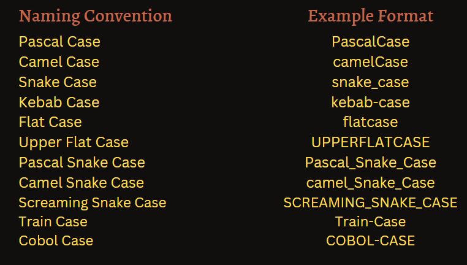

---

# . Naming Conventions

## Case Styles


### also we have

**Double Underscore**: `__private_variable` (Python only, used for name mangling)

---
## Rules for Naming Variables

- Variable names must contain only letters, digits, and underscores (`_`).
- Variable names **cannot** start with a digit.
- Variable names are **case-sensitive** (e.g., `myVar` and `myvar` are different).
- **Avoid** using Python keywords (e.g., `if`, `else`, `for`) as variable names.
- **Hyphens** are not allowed; use underscores instead (i.e., avoid kebab case).

---

### Special Variable Naming Conventions

- **Regular Variable**: `total_cost` (General use)
- **Constant**: `PI = 3.14159` (Constants, typically all uppercase)
- **Class Name**: `BankAccount` (Class names, PascalCase)
- **Private Variable**: `_password` (Internal use, conventionally private)
- **Private with Name Mangling**: `__secret_key` (Prevents accidental overrides)
- **Special Method**: `__init__` (Built-in methods, dunder methods)

---

### Summary of Naming Conventions

| Naming Style            | Usage                          | Example             |
|-------------------------|--------------------------------|---------------------|
| **snake_case**           | Variables & functions          | `user_name`, `total_price`  |
| **PascalCase**            | Classes                        | `BankAccount`, `DataScienceModel` |
| **UPPER_CASE**           | Constants                      | `MAX_SPEED`, `PI`    |
| **_single_underscore**   | Private variable (by convention) | `_config`           |
| **__double_underscore**  | Name mangling (avoid external access) | `__password`      |
| **__dunder__**           | Special methods                | `__init__`, `__str__` |

---

### Python Style Guide (PEP 8)

- **For Class Names**: Use `CapWords` (PascalCase).
- **For Variables, functions, and other identifiers**: Use `snake_case`.

---
## Reserved Words and Built-ins to Avoid as Variables

```python
import builtins, keyword

# 1) Hard keywords – absolutely forbidden
hard = set(keyword.kwlist)

# 2) Soft keywords – legal but confusing
soft = set(keyword.softkwlist)

# 3) Built-ins – legal but risky
built_in = set(dir(builtins))

discouraged = soft | built_in  # Includes hard keywords as well

# Print discouraged names
for name in discouraged:
    print(name)
```

#### Example Outputs

```
repr
license
RuntimeError      
ArithmeticError   
StopAsyncIteration
SyntaxError       
NotADirectoryError
range
BaseException     
abs
min
zip
TimeoutError
TypeError
InterruptedError
complex
ProcessLookupError
ConnectionResetError
AssertionError
map
UnicodeTranslateError
IndentationError
DeprecationWarning
SyntaxWarning
filter
PermissionError
__package__
ConnectionError
reversed
memoryview
None
credits
NameError
vars
EOFError
ZeroDivisionError
staticmethod
copyright
all
FileNotFoundError
EnvironmentError
float
tuple
UserWarning
breakpoint
__build_class__
UnicodeEncodeError
id
max
type
object
FileExistsError
ord
match
Warning
bin
hex
list
NotImplemented
IOError
iter
EncodingWarning
open
IndexError
ModuleNotFoundError
StopIteration
sorted
ValueError
getattr
quit
OverflowError
ReferenceError
pow
setattr
_
len
slice
input
BlockingIOError
False
__import__
UnboundLocalError
ConnectionRefusedError
property
hash
AttributeError
GeneratorExit
BaseExceptionGroup
dict
SystemExit
globals
BytesWarning
help
UnicodeWarning
sum
compile
SystemError
TabError
NotImplementedError
__spec__
ResourceWarning
str
FloatingPointError
Exception
MemoryError
Ellipsis
case
KeyboardInterrupt
KeyError
super
ConnectionAbortedError
callable
ImportError
aiter
bytes
RecursionError
delattr
int
PythonFinalizationError
RuntimeWarning
eval
True
FutureWarning
OSError
PendingDeprecationWarning
exec
__doc__
next
isinstance
hasattr
LookupError
ImportWarning
UnicodeDecodeError
chr
anext
divmod
issubclass
WindowsError
__name__
__debug__
bool
exit
set
oct
BufferError
any
_IncompleteInputError
locals
ChildProcessError
frozenset
__loader__
dir
round
format
BrokenPipeError
bytearray
print
ExceptionGroup
ascii
classmethod
enumerate
UnicodeError
IsADirectoryError
```

- **Avoid using `hard` keywords.**
- **Avoid `soft` keywords** (e.g., `"match"`, `"case"`).
- **Avoid `built_in` names** (e.g., `"list"`, `"dict"`, `"print"`, `"Exception"`).

---

**Printing All Keywords at Once**

```python
import keyword
print(keyword.kwlist)
```

**List of Keywords:**

```
['False', 'None', 'True', 'and', 'as', 'assert', 'async', 'await', 'break', 'class', 'continue', 'def', 'del', 'elif', 'else', 'except', 'finally', 'for', 'from', 'global', 'if', 'import', 'in', 'is', 'lambda', 'nonlocal', 'not', 'or', 'pass', 'raise', 'return', 'try', 'while', 'with', 'yield']
```
**Printing All builtin keywords at Once**

```python
import builtins
print(dir(builtins))  # Display built-in functions, types, and exceptions

# Print each built-in item
for item in dir(builtins):
    print(item)
```

**List of Built-ins:**

```
['ArithmeticError', 'AssertionError', 'AttributeError', 'BaseException', 'BaseExceptionGroup', 'BlockingIOError', 'BrokenPipeError', 'BufferError', 'BytesWarning', 'ChildProcessError', 'ConnectionAbortedError', 'ConnectionError', 'ConnectionRefusedError', 'ConnectionResetError', 'DeprecationWarning', 'EOFError', 'Ellipsis', 'EncodingWarning', 'EnvironmentError', 'Exception', 'ExceptionGroup', 'False', 'FileExistsError', 'FileNotFoundError', 'FloatingPointError', 'FutureWarning', 'GeneratorExit', 'IOError', 'ImportError', 'ImportWarning', 'IndentationError', 'IndexError', 'InterruptedError', 'IsADirectoryError', 'KeyError', 'KeyboardInterrupt', 'LookupError', 'MemoryError', 'ModuleNotFoundError', 'NameError', 'None', 'NotADirectoryError', 'NotImplemented', 'NotImplementedError', 'OSError', 'OverflowError', 'PendingDeprecationWarning', 'PermissionError', 'ProcessLookupError', 'PythonFinalizationError', 'RecursionError', 'ReferenceError', 'ResourceWarning', 'RuntimeError', 'RuntimeWarning', 'StopAsyncIteration', 'StopIteration', 'SyntaxError', 'SyntaxWarning', 'SystemError', 'SystemExit', 'TabError', 'TimeoutError', 'True', 'TypeError', 'UnboundLocalError', 'UnicodeDecodeError', 'UnicodeEncodeError', 'UnicodeError', 'UnicodeTranslateError', 'UnicodeWarning', 'UserWarning', 'ValueError', 'Warning', 'WindowsError', 'ZeroDivisionError', '_IncompleteInputError', '__build_class__', '__debug__', '__doc__', '__import__', '__loader__', '__name__', '__package__', '__spec__', 'abs', 'aiter', 'all', 'anext', 'any', 'ascii', 'bin', 'bool', 'breakpoint', 'bytearray', 'bytes', 'callable', 'chr', 'classmethod', 'compile', 'complex', 'copyright', 'credits', 'delattr', 'dict', 'dir', 'divmod', 'enumerate', 'eval', 'exec', 'exit', 'filter', 'float', 'format', 'frozenset', 'getattr', 'globals', 'hasattr', 'hash', 'help', 'hex', 'id', 'input', 'int', 'isinstance', 'issubclass', 'iter', 'len', 'license', 'list', 'locals', 'map', 'max', 'memoryview', 'min', 'next', 'object', 'oct', 'open', 'ord', 'pow', 'print', 'property', 'quit', 'range', 'repr', 'reversed', 'round', 'set', 'setattr', 'slice', 'sorted', 'staticmethod', 'str', 'sum', 'super', 'tuple', 'type', 'vars', 'zip']        
ArithmeticError
AssertionError
AttributeError
BaseException
BaseExceptionGroup
BlockingIOError
BrokenPipeError
BufferError
BytesWarning
ChildProcessError
ConnectionAbortedError
ConnectionError
ConnectionRefusedError
ConnectionResetError
DeprecationWarning
EOFError
Ellipsis
EncodingWarning
EnvironmentError
Exception
ExceptionGroup
False
FileExistsError
FileNotFoundError
FloatingPointError
FutureWarning
GeneratorExit
IOError
ImportError
ImportWarning
IndentationError
IndexError
InterruptedError
IsADirectoryError
KeyError
KeyboardInterrupt
LookupError
MemoryError
ModuleNotFoundError
NameError
None
NotADirectoryError
NotImplemented
NotImplementedError
OSError
OverflowError
PendingDeprecationWarning
PermissionError
ProcessLookupError
PythonFinalizationError
RecursionError
ReferenceError
ResourceWarning
RuntimeError
RuntimeWarning
StopAsyncIteration
StopIteration
SyntaxError
SyntaxWarning
SystemError
SystemExit
TabError
TimeoutError
True
TypeError
UnboundLocalError
UnicodeDecodeError
UnicodeEncodeError
UnicodeError
UnicodeTranslateError
UnicodeWarning
UserWarning
ValueError
Warning
WindowsError
ZeroDivisionError
_IncompleteInputError
__build_class__
__debug__
__doc__
__import__
__loader__
__name__
__package__
__spec__
abs
aiter
all
anext
any
ascii
bin
bool
breakpoint
bytearray
bytes
callable
chr
classmethod
compile
complex
copyright
credits
delattr
dict
dir
divmod
enumerate
eval
exec
exit
filter
float
format
frozenset
getattr
globals
hasattr
hash
help
hex
id
input
int
isinstance
issubclass
iter
len
license
list
locals
map
max
memoryview
min
next
object
oct
open
ord
pow
print
property
quit
range
repr
reversed
round
set
setattr
slice
sorted
staticmethod
str
sum
super
tuple
type
vars
zip

```

---
