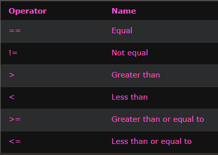
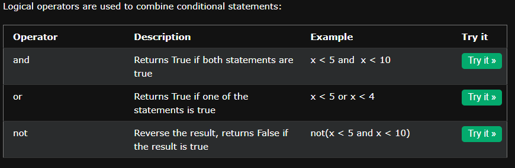

<font color="#372e2e" size="7">**Operator and Operand**</font>
* **Operator**: A symbol that performs an operation (e.g., +, -, *, /).
* **Operand**: The value(s) or variable(s) that the operator works with.

[]

<font color="#4CAF50" size="6">⚙️ Python Operators</font>

---

<font color="#FF9800" size="5">☝️ Unary Operators (1 operand)</font>

| Operator       | Description                                      | Example      |
|----------------|--------------------------------------------------|--------------|
| `+`            | Unary plus (no change)                           | `+x`         |
| `-`            | Unary minus (negates value)                      | `-x`         |
| `~`            | Bitwise NOT (Inverts the bits of a number)       | `~x`         |
| `not`          | Logical NOT (boolean inversion)                  | `not x`      |
| `is` / `is not`| Identity check (memory reference comparison)     | `a is b`     |

---

<font color="#FF9800" size="5">✌️ Binary Operators (2 operands)</font>

### <font color="#2196F3" size="4">🔢 Arithmetic</font>  
`+`, `-`, `*`, `/`, `//`, `%`, `**`

### <font color="#2196F3" size="4">📝 Assignment</font>  
`=`, `+=`, `-=`, `*=`, `/=`, `//=`, `%=`, `**=` , `&=`, `|=`, `^=`, `>>=`, `<<=`,`:=`

### <font color="#cd07a1" size="4">🧮 Comparison</font>  
`==`, `!=`, `>`, `<`, `>=`, `<=`

### <font color="#2196F3" size="4">⚙️ Logical</font>  
`and`, `or`

### <font color="#2196F3" size="4">🧠 Bitwise</font>  
`&`, `|`, `^`, `<<`, `>>`

### <font color="#2196F3" size="4">🔍 Identity</font>  
`is`, `is not`

### <font color="#2196F3" size="4">📦 Membership</font>  
`in`, `not in`

---

<font color="#FF9800" size="5">🧠 Quick Recap</font>

- **Unary**: One operand → `-x`, `not a`, `~x`
- **Binary**: Two operands → `a + b`, `x in y`, `a is b`

---

<font color="#FF9800" size="5">**Bitwise Operators**</font>

- **&**: Only keeps 1 where both have 1  
  `5 = 0101`  
  `3 = 0011`  
  `& = 0001`

- **|**: Only keeps 1 where anyone has 1  
  `5 = 0101`  
  `3 = 0011`  
  `| = 0111`

- **^ (XOR)**: 1 if bits differ, 0 if same  
  `5 = 0101`  
  `3 = 0011`  
  `^ = 0110`

- **~**: Inverts all bits  
  `5 = 0101`  
  `~5 = 1010 (2's complement) = -6`

- **<<**: Left shift (adds 0s from right, rest drop off)  
  `5 = 0101`  
  `5 << 3 = 1000 (8 in decimal)`

- **>>**: Right shift (fills with 0 from left, rest drop off)  
  `5 = 0101`  
  `5 >> 3 = 0000 (0 in decimal)`

---

<font color="#FF9800" size="5">**Walrus Operator (`:=`)**</font>

The walrus operator allows you to assign a value to a variable inside an expression.  
Available from Python 3.8 onwards.

Example:

```python
nums = [n for n in range(10) if (sqr := n*n) > 10]
print(nums)  # Only keeps n where n*n > 10
```

Long Form:

```python
nums = []
for n in range(10):
    sqr = n * n
    if sqr > 10:
        nums.append(n)
print(nums)
```

---

<font color="#cd07a1" size="5">**Python Comparison Operators**</font>

[](https://www.w3schools.com/python/python_operators.asp)


<font color="#FF9800" size="5">**Python Logical Operators**</font>

[](https://www.w3schools.com/python/python_operators.asp)

<font color="#FF9800" size="5">**Python Identity Operators** `is`/`is not`</font>

- **is**: Returns True if both variables are the same object  
  `x = [1, 2, 3]`  
  `y = x`  
  `x is y` → `True`

- **is not**: Returns True if both variables are not the same object  
  `x = [1, 2, 3]`  
  `y = [1, 2, 3]`  
  `x is not y` → `True`


<font color="#FF9800" size="5">**Python Membership Operators** `in`/`in not`</font>

- **in**: Returns True if a sequence with the specified value is present in the object  
  `x = 5`  
  `y = [1, 2, 3, 4, 5]`  
  `x in y` → `True`

- **not in**: Returns True if a sequence with the specified value is not present in the object  
  `x = 10`  
  `y = [1, 2, 3, 4, 5]`  
  `x not in y` → `True`
