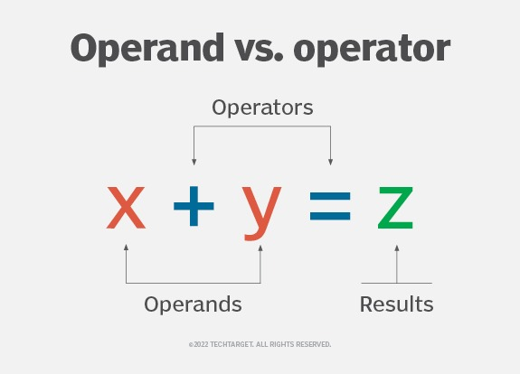
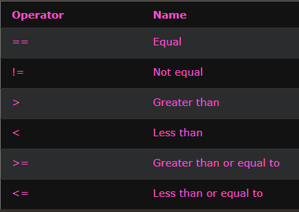
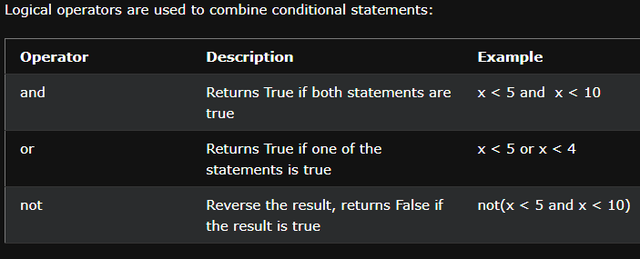

# **Operator and Operand**
* **Operator**: A symbol that performs an operation (e.g., +, -, *, /).
* **Operand**: The value(s) or variable(s) that the operator works with.


# ⚙️ Python Operators

## ⚡ Operator Overloading

Operator overloading allows you to define what +, -, *, or other operators should do when used with your objects.

Normally, + is used for addition: 5 + 3 → 8
But it also works for strings: "Hello" + "World" → "HelloWorld"
`**` not only use to make power but also to combine two dictionaries in 1one
Python already knows how to handle numbers and strings, but what if you create a custom object, like a "Warrior" or a "ShoppingCart"?

**Why is Operator Overloading Useful?**

Instead of writing complex methods like `add_warrior_strength(warrior1, warrior2)`, you can simply write `warrior1 + warrior2` and Python will know it means combining their strength—because you've taught it using operator overloading.


## ☝️ Unary Operators (1 operand)

| Operator       | Description                                      | Example      |
|----------------|--------------------------------------------------|--------------|
| `+`            | Unary plus (no change)                           | `+x`         |
| `-`            | Unary minus (negates value)                      | `-x`         |
| `~`            | Bitwise NOT (Inverts the bits of a number)       | `~x`         |
| `not`          | Logical NOT (boolean inversion)                  | `not x`      |
| `is` / `is not`| Identity check (memory reference comparison)     | `a is b`     |

---

## ✌️ Binary Operators (2 operands)

### 🔢 Arithmetic  
`+`, `-`, `*`, `/`, `//`, `%`, `**`

### 📝 Assignment  
`=`, `+=`, `-=`, `*=`, `/=`, `//=`, `%=`, `**=` , `&=`, `|=`, `^=`, `>>=`, `<<=`,`:=`

### 🧮 Comparison  
`==`, `!=`, `>`, `<`, `>=`, `<=`

### ⚙️ Logical  
`and`, `or`

### 🧠 Bitwise  
`&`, `|`, `^`, `<<`, `>>`

### 🔍 Identity  
`is`, `is not`

### 📦 Membership  
`in`, `not in`

---

## 🧠 Quick Recap

- **Unary**: One operand → `-x`, `not a`, `~x`
- **Binary**: Two operands → `a + b`, `x in y`, `a is b`

---

## **Bitwise Operators**

- **&**: Only keeps 1 where both have 1  
  `5 = 0101`  
  `3 = 0011`  
  `& = 0001`

- **|**: Only keeps 1 where anyone has 1  
  `5 = 0101`  
  `3 = 0011`  
  `| = 0111`

- **^ (XOR)**: 1 if bits differ, 0 if same  
  `5 = 0101`  
  `3 = 0011`  
  `^ = 0110`

- **~**: Inverts all bits  
  `5 = 0101`  
  `~5 = 1010 (2's complement) = -6`

- **<<**: Left shift (adds 0s from right, rest drop off)  
  `5 = 0101`  
  `5 << 3 = 1000 (8 in decimal)`

- **>>**: Right shift (fills with 0 from left, rest drop off)  
  `5 = 0101`  
  `5 >> 3 = 0000 (0 in decimal)`

---

## **Walrus Operator (`:=`)**

The walrus operator allows you to assign a value to a variable inside an expression.  
Available from Python 3.8 onwards.

Example:

```python
nums = [n for n in range(10) if (sqr := n*n) > 10]
print(nums)  # Only keeps n where n*n > 10
```

Long Form:

```python
nums = []
for n in range(10):
    sqr = n * n
    if sqr > 10:
        nums.append(n)
print(nums)
```

---

## **Python Comparison Operators**

[](https://www.w3schools.com/python/python_operators.asp)

### Comparison for Strings in Python
Python compares strings character by character using their Unicode values.
```py
'a' < 'b'#True  because the Unicode value of 'a' (97) is smaller than that of 'b' (98).

'apple' < 'banana' #True bcz 'a' < 'b', so Python stops there

print("Apple" > "apple")  # False ('A' has a smaller Unicode value than 'a')
print("apple" == "APPLE") # False (case-sensitive)
print("abc" < "abd")      # True ('c' < 'd')
```

## **Python Logical Operators**

[](https://www.w3schools.com/python/python_operators.asp)

## **Python Identity Operators** `is`/`is not`

- **is**: Returns True if both variables are the same object  
  `x = [1, 2, 3]`  
  `y = x`  
  `x is y` → `True`

- **is not**: Returns True if both variables are not the same object  
  `x = [1, 2, 3]`  
  `y = [1, 2, 3]`  
  `x is not y` → `True`


## **Python Membership Operators** `in`/`in not`

- **in**: Returns True if a sequence with the specified value is present in the object  
  `x = 5`  
  `y = [1, 2, 3, 4, 5]`  
  `x in y` → `True`

- **not in**: Returns True if a sequence with the specified value is not present in the object  
  `x = 10`  
  `y = [1, 2, 3, 4, 5]`  
  `x not in y` → `True`
